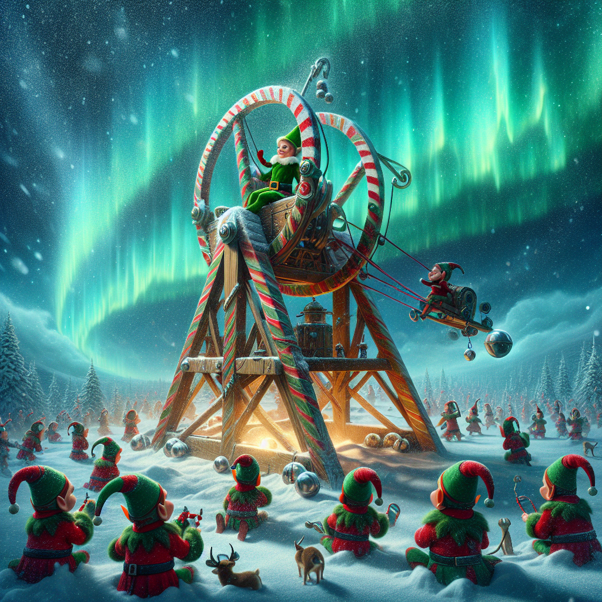

# Day 1: Trebuchet?!

In the heart of a snow-covered village, the Christmas elves are in a flurry of activity. Their faces, a blend of determination and joy, are framed by pointed hats dusted with frost. The village is aglow with twinkling lights and garlands, but the usually bustling workshop stands still, the air tense with concern. The elves' mission is clear: solve the puzzle to save Christmas.

The workshop is a treasure trove of festive decorations and tools, with candy cane-striped screwdrivers and holly-embellished hammers. One elf, her cheeks rosy and eyes narrowed in concentration, examines a piece of parchment, the amended calibration document, her fingers tracing the lines of text and whimsical drawings made by a young elf.

Her companions gather around, their pointed ears twitching as they ponder over the clues. They work together, their small hands moving deftly as they combine traditional methods with magical tools—a compass that always points to the North Star, a magnifying glass that reveals the hidden, and an abacus with beads shaped like miniature snowflakes.

A breakthrough comes when an elf, with a eureka moment evident in his wide-eyed expression, realizes that some digits are spelled out in letters. The team's frustration turns to exhilaration, their earlier tension melting away like snow on a sunny day.

They recalibrate, their nimble fingers dancing over the document. As they sum up the true calibration values, the village seems to breathe a collective sigh of relief. The elves share high-fives and hugs, their laughter ringing through the crisp winter air, as the workshop roars back to life, ready to restore snow operations and keep the spirit of Christmas alive.

