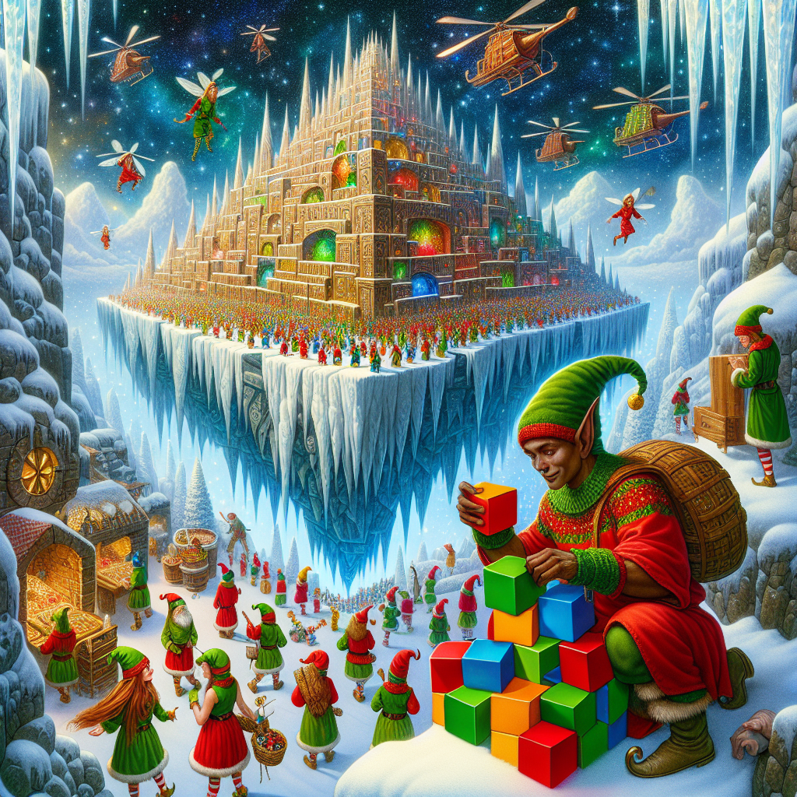
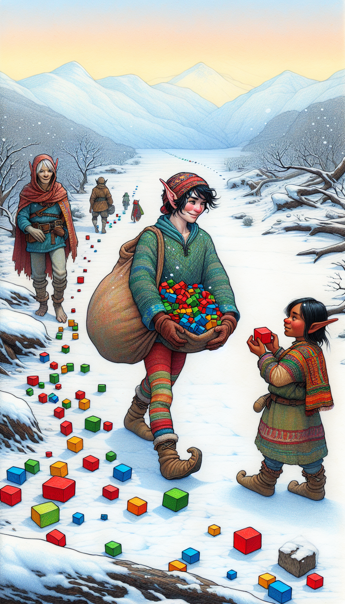

# Day 2: Cube Conundrum

In the story, you find yourself on a floating island called Snow Island, greeted by an elf who informs you of the
unusual lack of snow. The elf invites you to play a game involving a small bag and colored cubes—red, green, and
blue—while explaining the situation. As you play, the elf draws random handfuls of cubes from the bag, showing them to
you before placing them back. You're tasked with deducing information about the number of cubes based on these revealed
subsets.

The island is depicted as a cold place with a scarcity of snow, and the elf is eager to share the game with you. The
elf's concern about the stopped snow production due to a lack of water is evident, and he suggests visiting the water
source to investigate the issue. The story is interwoven with the challenge of determining the possible configurations
of cubes in the bag and the minimum number of cubes required for the game to be feasible.

