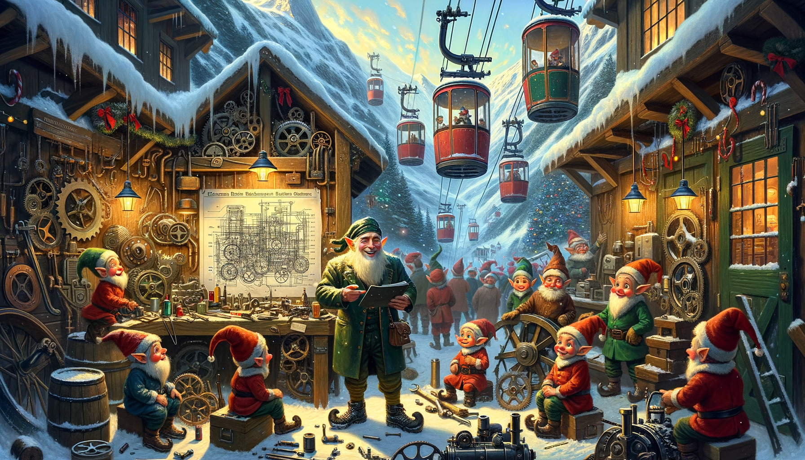
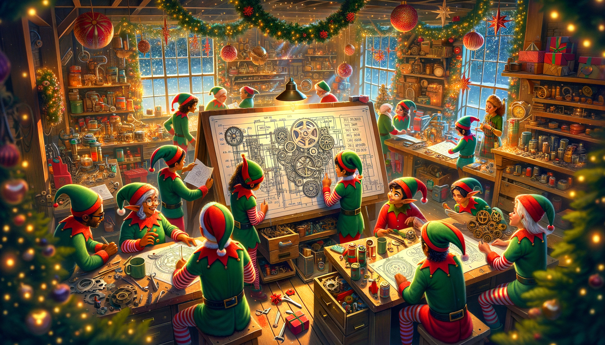
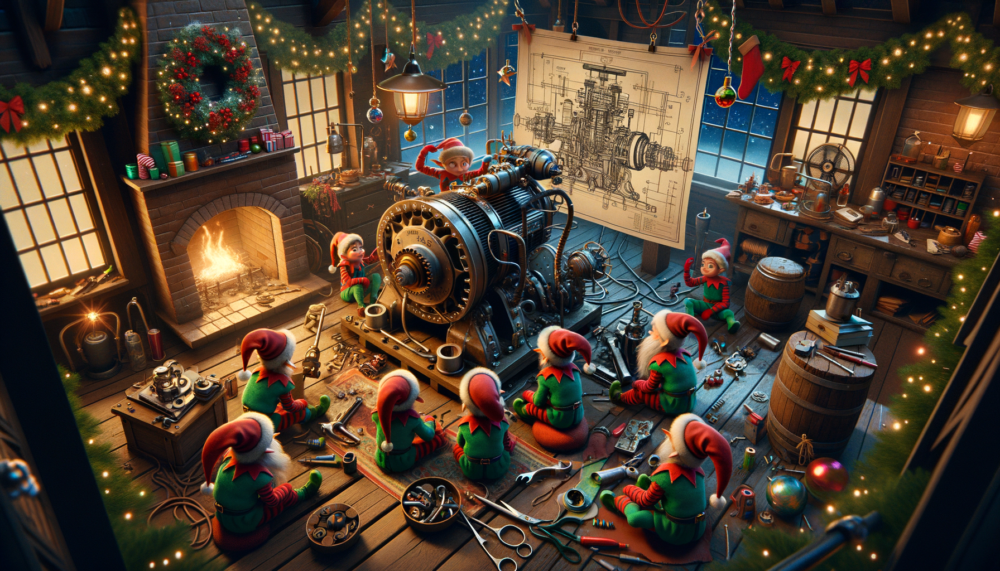
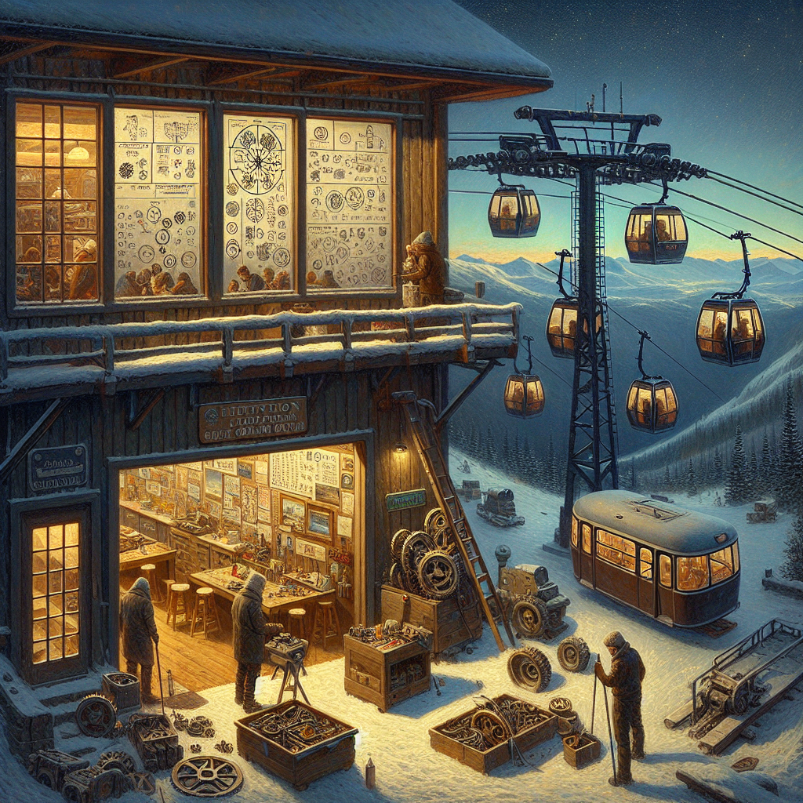

# Day 3: Gear Ratios

In the story, the protagonist and an elf arrive at a gondola lift station on their way to a water source, only to find
the gondolas are not operational. A greasy elf with a wrench, who appears to be an engineer, is surprised by their
arrival and explains that the lift is broken due to a missing engine part. The protagonist offers to help by calculating
the sum of all part numbers in the engine schematic to identify the missing piece.

After solving the puzzle, the engineer installs the missing part, but the gondola still moves slowly. The engineer,
holding a phone and waving, communicates that another issue persists: an incorrect gear in the engine. The protagonist
must now calculate the gear ratios by identifying gears in the schematic and summing their ratios to determine which
gear needs replacement.

The story includes elements such as a gondola lift station, a surprised and greasy elf with a wrench, an engine
schematic filled with numbers and symbols, a non-functional gondola, and a phone labeled "help" used for communication
between the protagonist and the engineer.

