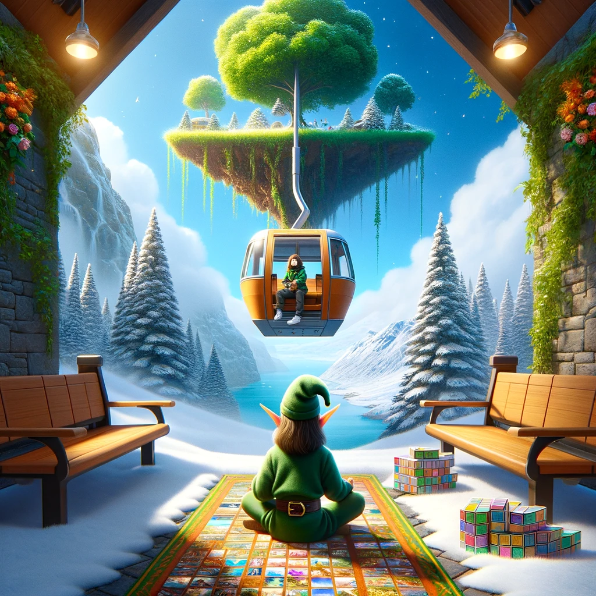
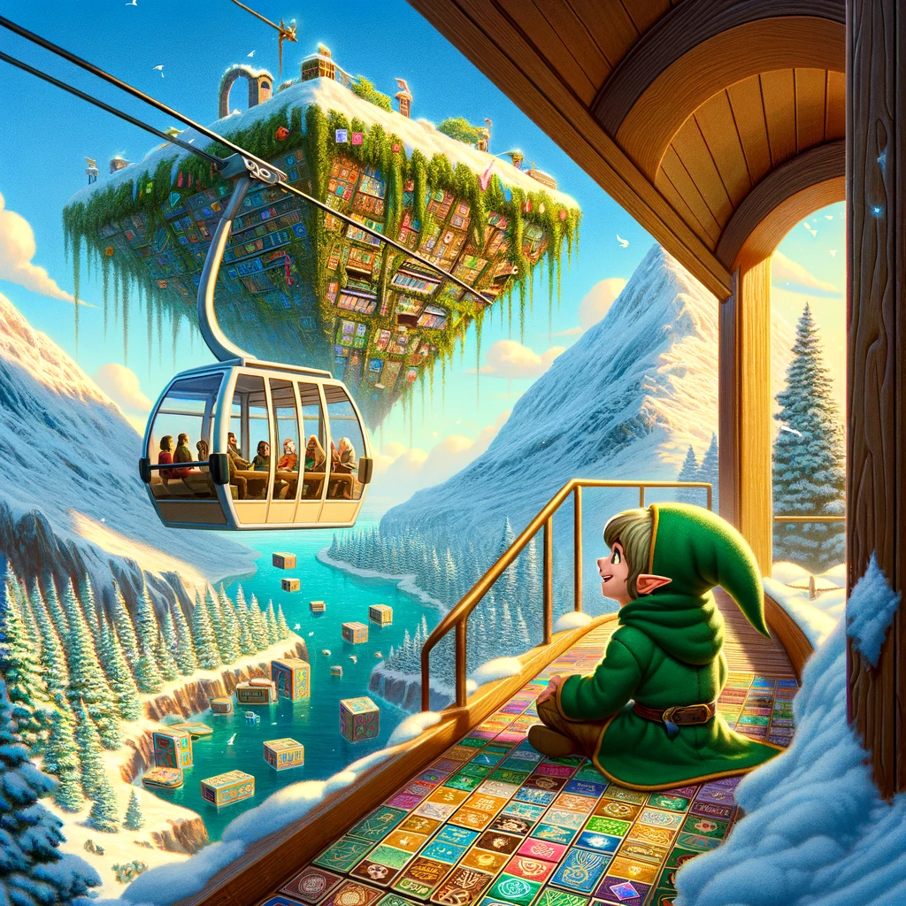
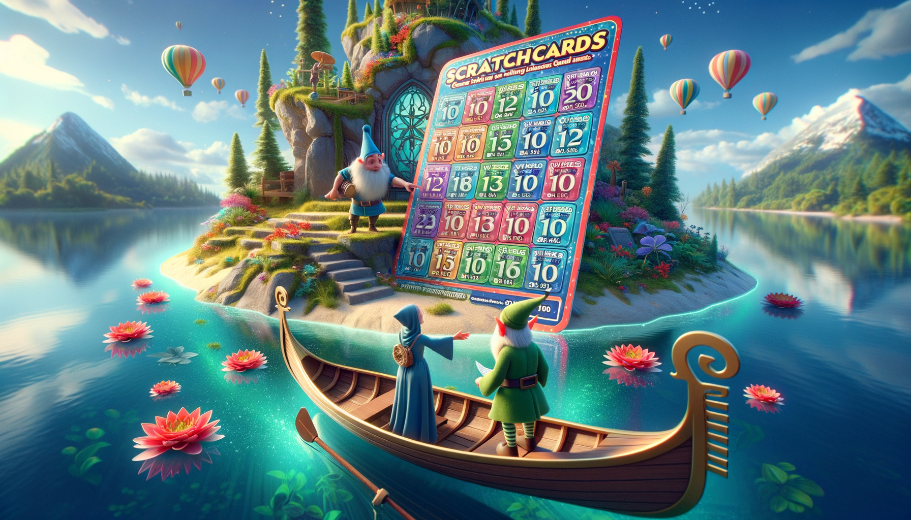
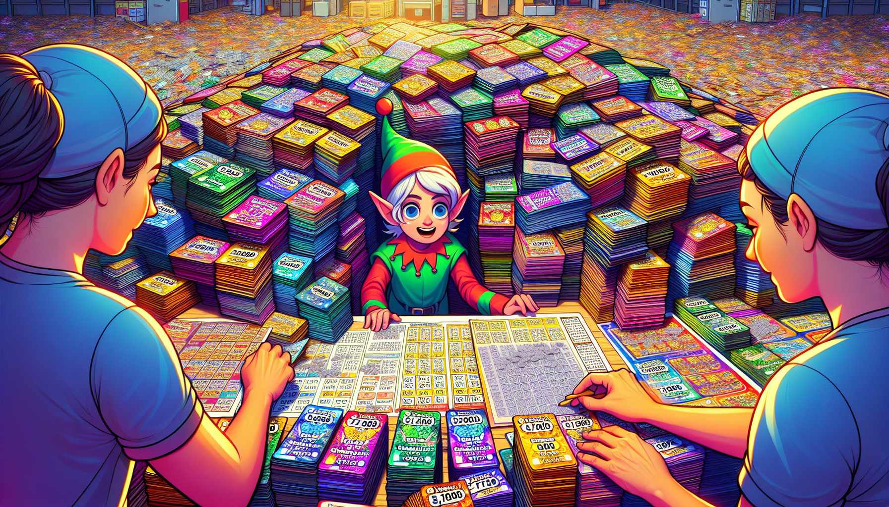

# Day 4: Scratchcards

In the story, a gondola transports you to a new island with a warmer and more humid climate than Snow Island. Upon
arrival, you encounter an Elf surrounded by a pile of colorful square cards, which are revealed to be scratchcards with
their coverings already scratched off. The Elf, who operates the gondola, offers to lend you a boat to visit the
gardener on another island if you assist with determining the value of the scratchcards. The Elf explains that the cards
have lists of winning numbers and numbers you have, and points are earned based on matches. After organizing the cards,
you calculate the total points. Later, it's discovered that the actual rule is that scratchcards win more scratchcards,
not points, leading to a process of copying and winning additional cards. The story concludes with the calculation of
the total number of scratchcards you end up with.

