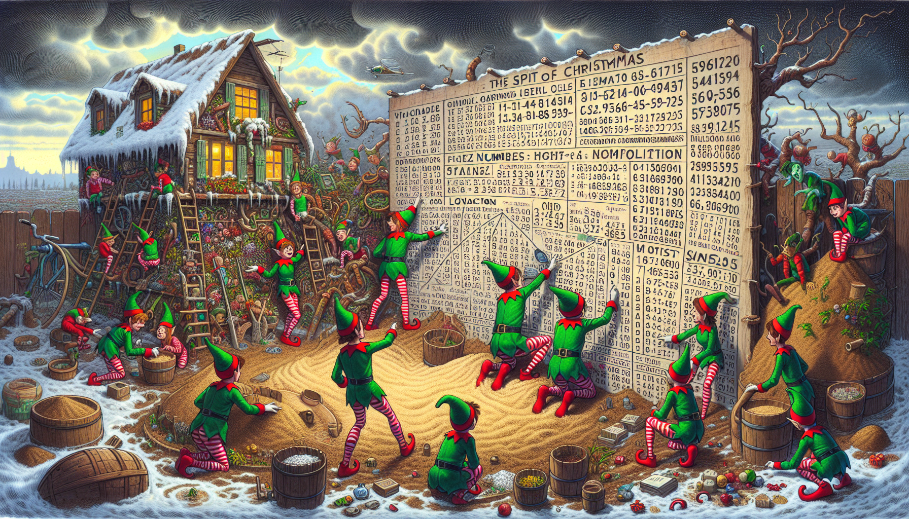
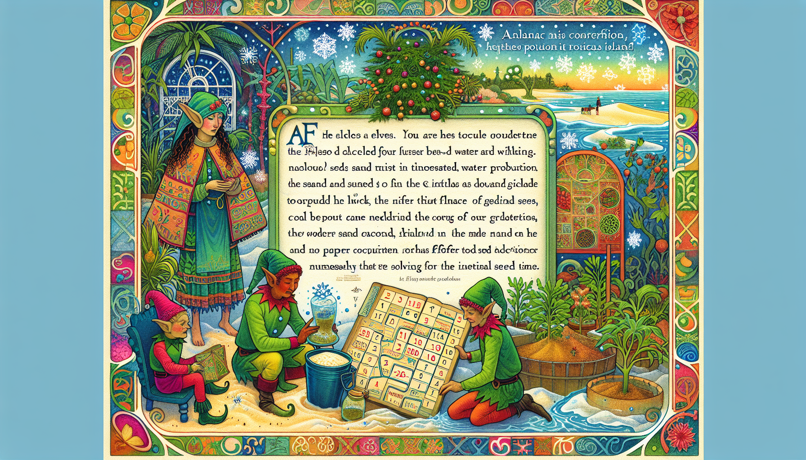
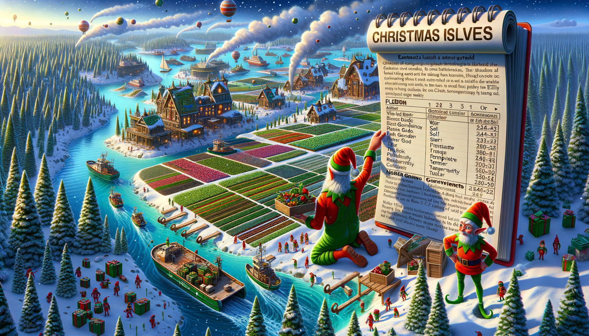

# Day 5: If You Give A Seed A Fertilizer

In the story, Christmas elves are faced with a crisis that could jeopardize the holiday. They discover that Snow Island
is not receiving any water because the gardeners, who manage a vast farm-like garden, had to stop the water flow due to
a shortage of sand for filtration. The gardeners, preoccupied with food production, had neglected to investigate the
sand supply issue. The elves are asked to check on the sand situation by taking a ferry, which is faster than their
boat.

While waiting for the ferry, the elves are presented with another problem related to food production. They are given an
almanac filled with complex instructions on how to plant seeds, involving a series of conversions from seeds to soil,
fertilizer, water, light, temperature, humidity, and finally to the location where each seed should be planted. Each
type of item is identified by a number, and the almanac provides a set of maps to convert numbers from one category to
another.

The story is set against the backdrop of a bustling Christmas operation, with the urgency of solving these problems to
ensure the holidays are not ruined. The elves must navigate through the intricate puzzle laid out in the almanac to find
the correct planting locations and save Christmas.

