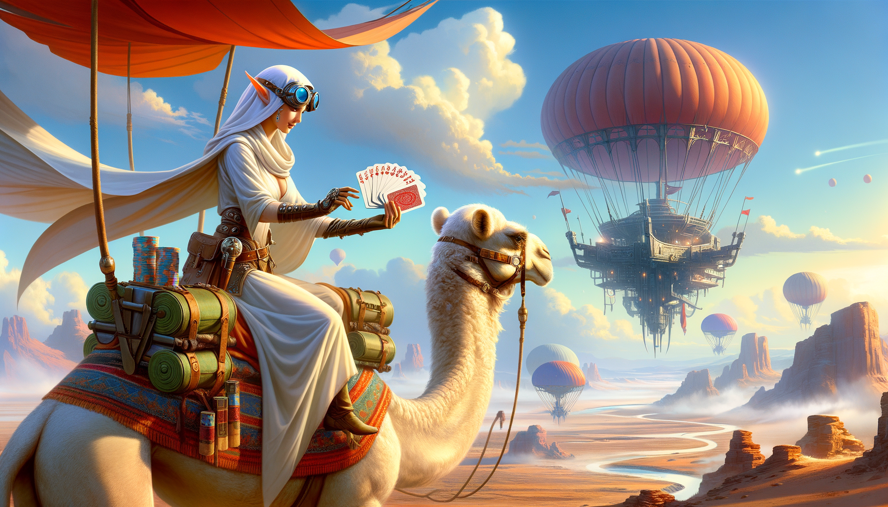
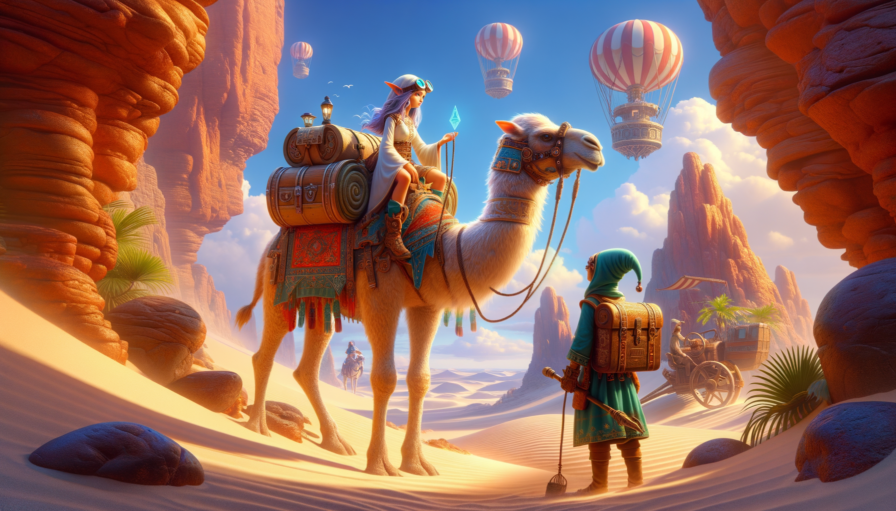

# Day 7: Camel Cards

In the story, you find yourself on a desert island after a brief airship ride. An elf, dressed in white and wearing
goggles, greets you while riding a large camel. She inquires about parts needed to fix machines that move rocks and
filter sand on the island. The machines are broken because the island stopped receiving the necessary parts. Agreeing to
help, you embark on a multi-day journey across the desert with the elf. To pass the time, she teaches you a game called
Camel Cards, which is similar to poker but simplified for camelback play. The game involves ranking hands of five cards
by their strength, with various combinations such as "Five of a kind" and "Full house" determining the hierarchy. The
story revolves around the strategic play of Camel Cards as you assist the elf with the island's predicament.

