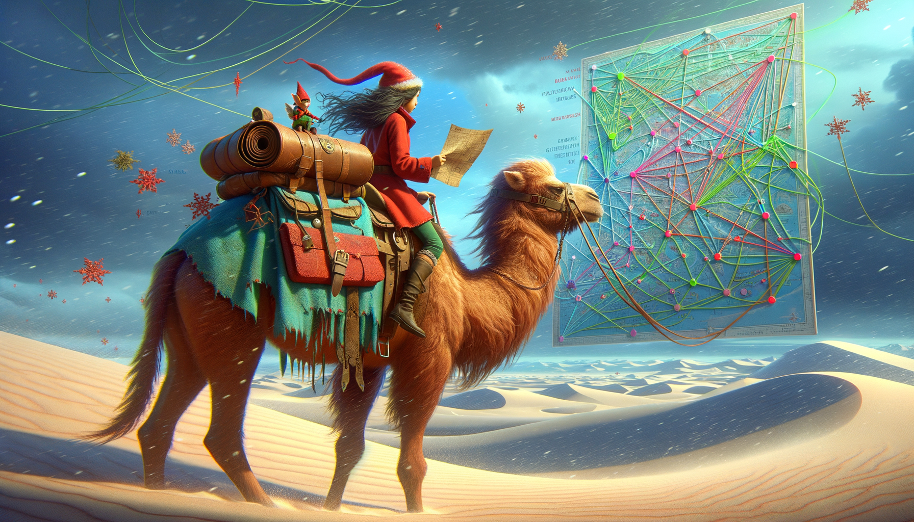

# Day 8: Haunted Wasteland

In the midst of a desert journey, a Christmas elf vanishes just as a sandstorm looms near. The traveler, left with a
camel, discovers a pouch labeled "maps" containing documents with navigation instructions through a network of labeled
nodes. The goal is to reach a node marked 'ZZZ' from the starting point 'AAA' by following a sequence of left and right
directions. As the storm intensifies, the traveler contemplates that the maps might be intended for ghosts, considering
the equal number of nodes ending in 'A' and 'Z'. The strategy shifts to simultaneously navigating from all 'A' ending
nodes until all paths converge on nodes ending with 'Z'. The scene is set in a hauntingly barren landscape, with
swirling sands and the constant presence of a camel, the traveler's sole companion and bearer of the mysterious maps.

