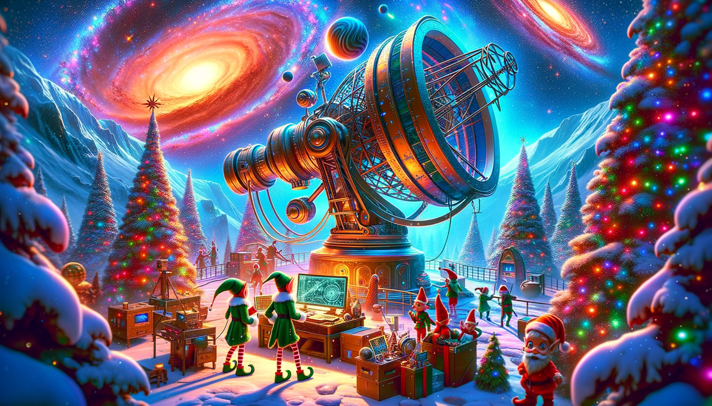
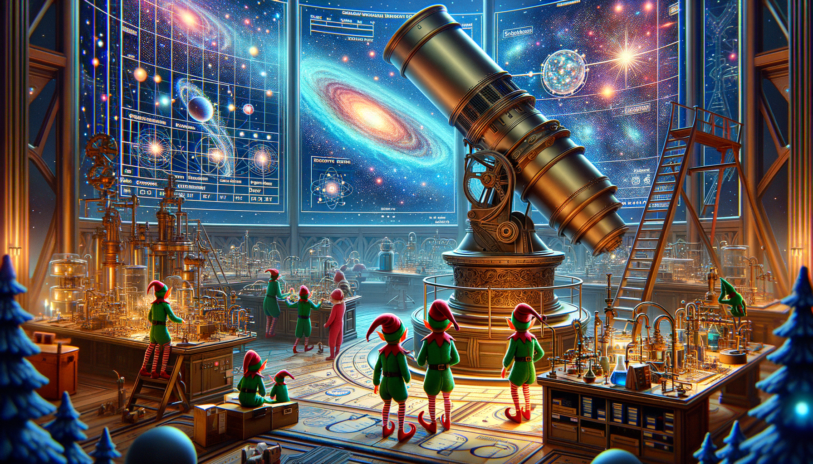
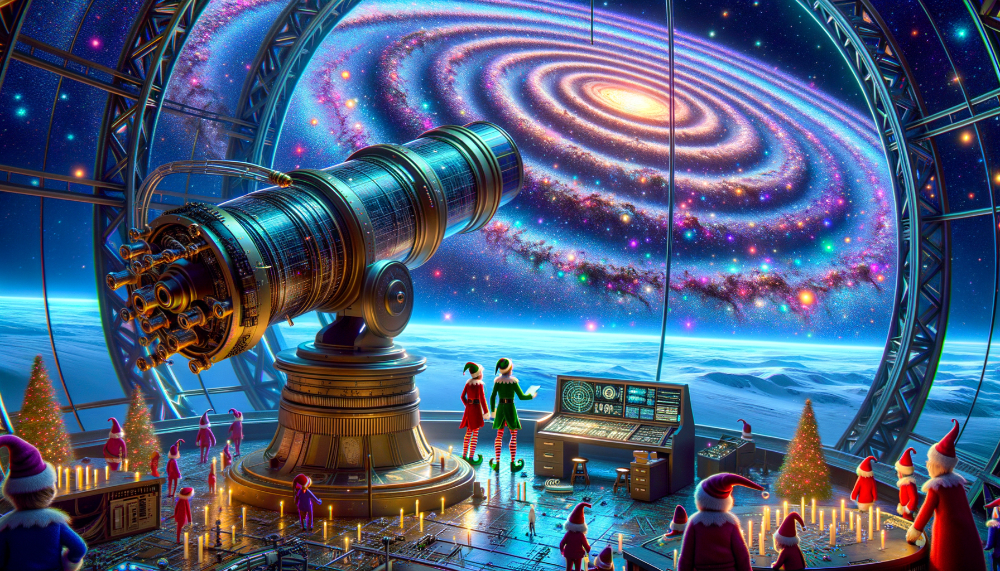
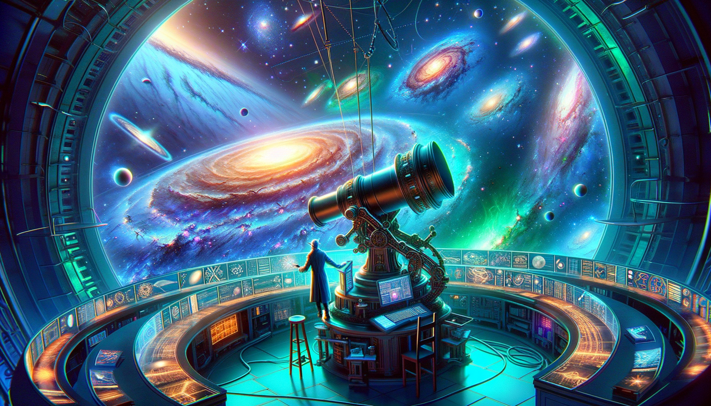

# Day 11: Cosmic Expansion

Once upon a time, in a universe far, far away, there was a group of diligent elves working in an observatory. They were
studying cosmic expansion using a giant telescope. However, they faced a dilemma when they needed to find the sum of the
lengths of the shortest paths between every pair of galaxies.

The universe had expanded, and due to gravitational effects, only some space expanded. Rows and columns that contained
no galaxies were required to be twice as big. The elves had to expand the universe and find the length of the shortest
path between every pair of galaxies.

After much hard work, they were able to find the sum of these lengths, which turned out to be `9974721`.

But their work was not over yet. The galaxies turned out to be much older and farther apart than initially estimated.
The elves had to expand the universe even further, making each empty row or column one million times larger. After
expanding the universe and finding the length of the shortest path between every pair of galaxies, they discovered that
the sum of these lengths was `702770569197`.

With their mission accomplished, the elves celebrated their success and continued their research on cosmic expansion,
knowing that they had made a significant contribution to the study of the universe.

And so, the diligent elves in the observatory continued their work, exploring the mysteries of the cosmos and expanding
their knowledge with each passing day.

