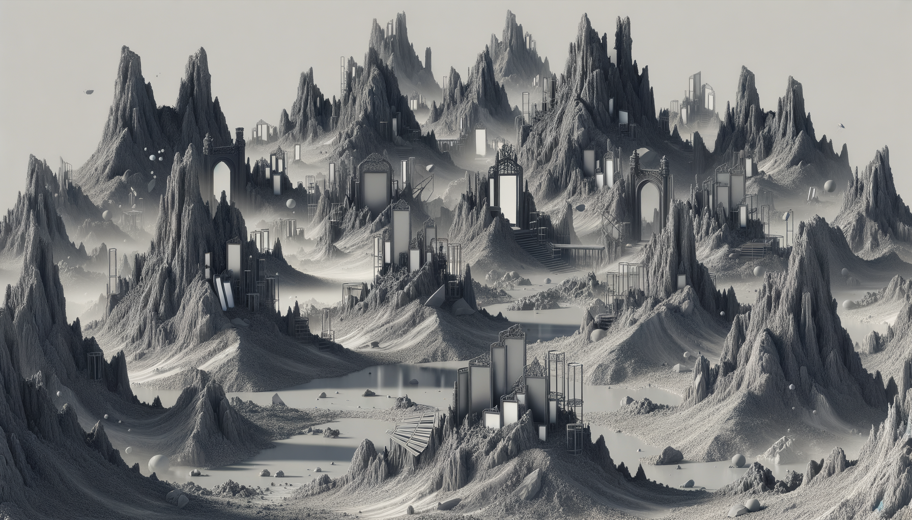

# Day 13: Point of Incidence

Once upon a time in the magical land of Lava Island, the hot springs team embarked on a journey to find the perfect
spring. However, upon reaching the island, they were surprised to find no lava, only ash and igneous rock. As they
ventured further, they stumbled upon a valley filled with large mirrors, some of which had fallen and were lodged into
the ash at strange angles.

The team carefully noted down the patterns of ash (`.`) and rocks (`#`) they observed as they walked through the valley.
They soon realized that to find the reflection in each pattern, they needed to locate a perfect reflection across either
a horizontal line between two rows or across a vertical line between two columns.

After analyzing the patterns, they summarized their notes by adding up the number of columns to the left of each
vertical line of reflection and also adding 100 multiplied by the number of rows above each horizontal line of
reflection.

As they continued their journey, they accidentally ran into one of the mirrors. Upon closer inspection, they discovered
that every mirror had exactly one smudge, where exactly one `.` or `#` should be the opposite type. They needed to fix
the smudge in each pattern to cause a different reflection line to be valid.

After fixing the smudges and finding the different reflection lines, they summarized their notes again using the new
reflection lines.

In the end, they found the numbers after summarizing all their notes and the new reflection lines, which were `31956`
and `37617` respectively.

And so, the hot springs team completed their adventure on Lava Island, having successfully navigated the valley of
mirrors and fixed the smudges to find the perfect reflection.

The End.

