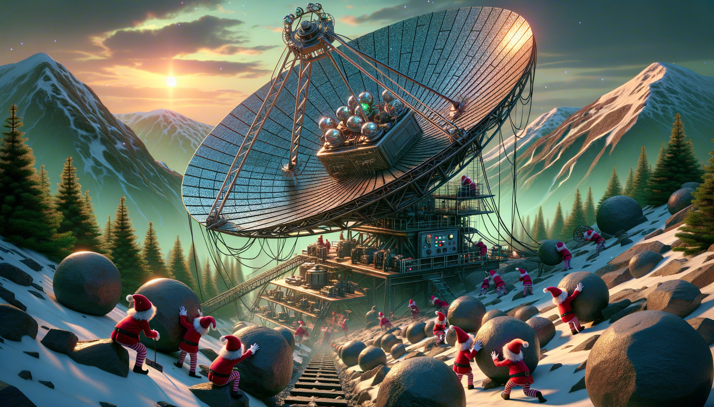

# Day 14: Parabolic Reflector Dish

Once upon a time in the magical village of Elftopia, the elves were preparing for Christmas. The village was covered in
a thick blanket of snow, and the air was filled with the sound of joy and laughter. The elves were busy in their
workshop, crafting toys and gifts for children all around the world.

In the heart of the village, there stood a magnificent parabolic reflector dish, attached to the side of a large
mountain. The dish was made up of many small mirrors, each pointing in slightly the wrong direction. Instead of focusing
light, it was sending it in a vague direction.

The dish was crucial for the village, as it provided the energy for the magical lava that powered their workshop. The
elves knew that if they could focus the reflector dish, they could fix the lava production and ensure a merry Christmas
for everyone.

Upon closer inspection, the elves discovered that the individual mirrors were connected to a large metal platform via an
elaborate system of ropes and pulleys. The platform was covered in large rocks of various shapes, and depending on their
position, the weight of the rocks deformed the platform, ultimately controlling the focus of the dish.

The elves quickly realized that by moving the rocks and tilting the platform, they could focus the dish. The platform
even had a control panel that allowed them to tilt it in different directions.

The elves started by tilting the lever so all of the rocks would slide north as far as they could go. They carefully
noted the positions of the rocks and empty spaces and calculated the total load on the north support beams.

After successfully tilting the platform, the elves decided to move the rocks to the edges of the platform. They found a
button labeled "spin cycle" on the control panel, which allowed them to cycle the platform so that the rounded rocks
rolled north, then west, then south, and finally east.

After running the spin cycle for a very long time, the elves were concerned about the north support beams. They needed
to calculate the total load on the north support beams after a billion cycles.

In the end, the elves successfully managed to focus the dish and ensure a magical Christmas for everyone in the village.
The total load on the north support beams after a billion cycles was `97241`, ensuring a joyous and bright Christmas for
all.

And so, the elves celebrated their success and continued their preparations for the most wonderful time of the year.

