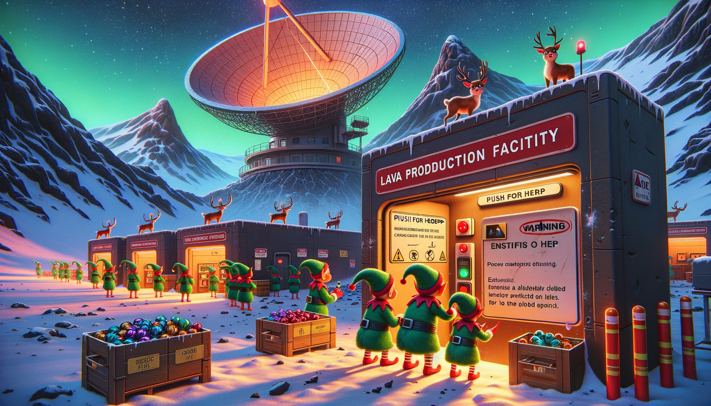

# Day 15: Lens Library

In the story, Christmas elves are at a facility embedded in a mountainside on Lava Island, where a large parabolic
reflector dish directs light to this location. The facility is marked with a sign indicating it's a "Lava Production
Facility" and warns of the need for personal protective equipment. Inside, a reindeer wearing goggles and a hard hat
guides the elves, leading them to a shelf where they equip themselves with safety gear. They pass a button labeled "PUSH
FOR HELP" with a snout mark on it, suggesting the reindeer's previous use.

The facility houses a room filled with an array of lenses designed to focus the collected light. The reindeer presents
the elves with an "Initialization Manual" that cheerfully instructs them on how to bring the facility online safely. The
manual includes an algorithm for turning strings of characters into numbers, which is crucial for the initialization
process.

The facility contains a series of numbered boxes with lens slots, and a library of lenses organized by focal length. The
reindeer also provides a label printer to assist with the process. The manual describes a procedure for inserting and
arranging lenses in the boxes according to the initialization sequence, which involves labeling and focusing the lenses
correctly. The story concludes with the elves successfully following the sequence and calculating the focusing power of
the lens configuration to ensure everything is installed correctly, thus saving Christmas.

