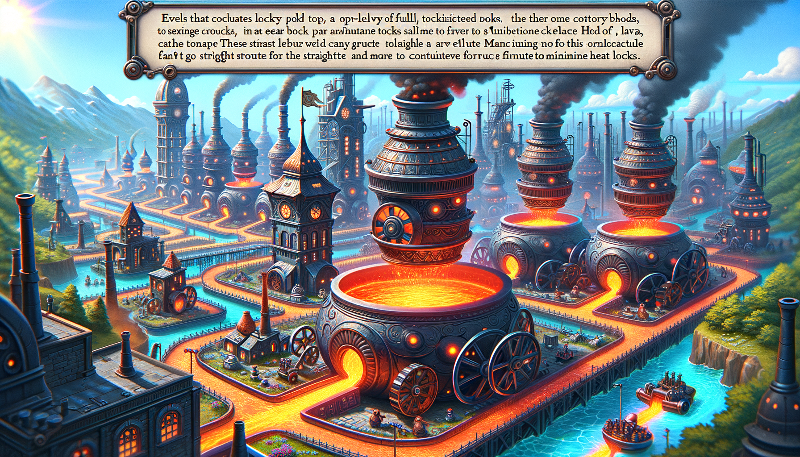
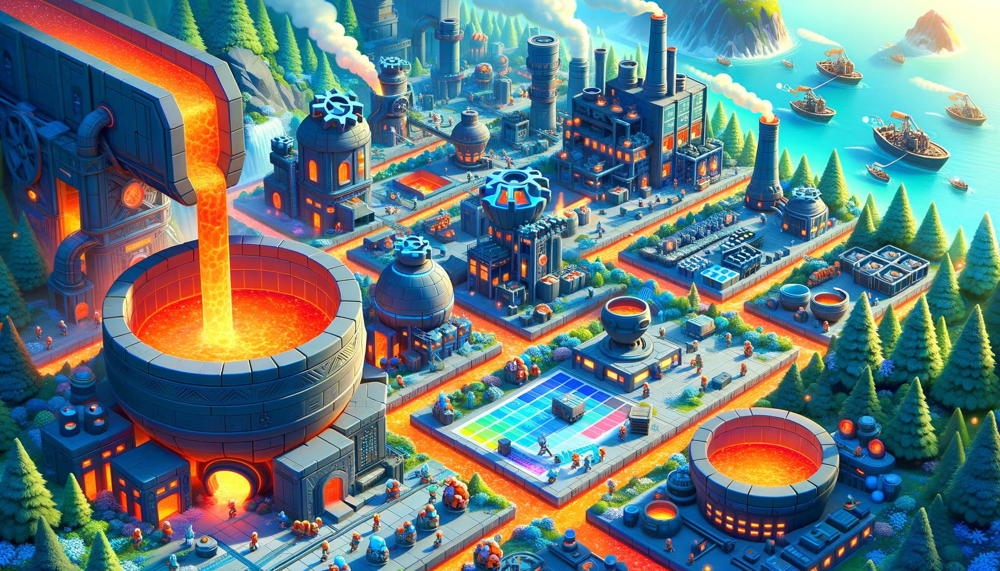

# Day 17: Clumsy Crucible

Once upon a time on Gear Island, the lava flowed rapidly from the Lava Production Facility. As the reindeer offered a
parachute, an elf descended with a bird's-eye view of the giant factory city below. The lava pool at the base of the
lavafall was being loaded into top-heavy crucibles on wheels by the elves.

The crucibles, difficult to steer at high speeds, needed to be maneuvered from the lava pool to the machine parts
factory. The goal was to minimize heat loss while avoiding long straight paths. The map provided by the elves detailed
the heat loss in each city block, with the starting point at the top-left and the destination at the bottom-right.

The crucible could move at most three blocks in a single direction before turning 90 degrees left or right. It couldn't
reverse direction and could only turn left, continue straight, or turn right after entering each city block.

The elves found a path that minimized heat loss, never moving more than three consecutive blocks in the same direction,
with a total heat loss of only 102.

Now, it's your turn to direct the crucible from the lava pool to the machine parts factory, minimizing heat loss and
avoiding long straight paths. What is the least heat loss it can incur?

The elves eagerly await your solution, as the fate of the machine parts factory depends on it.

