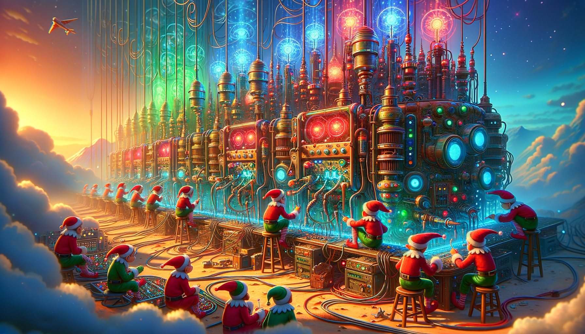
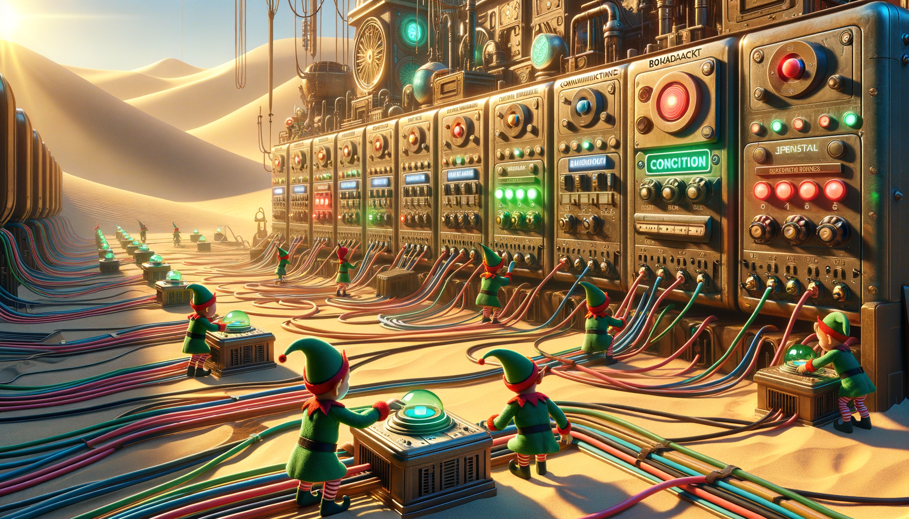
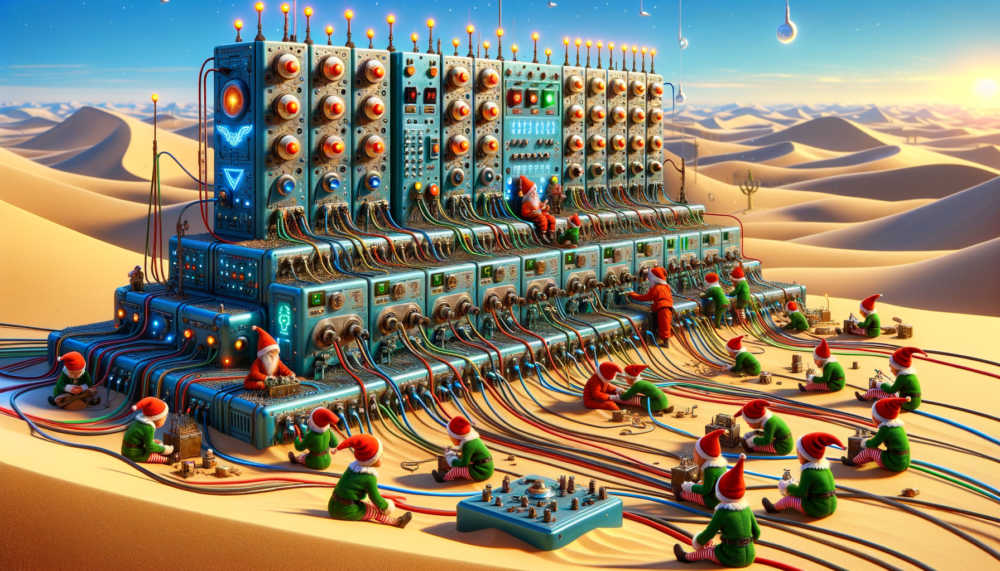

# Day 20: Pulse Propagation

In the story, Christmas elves are tasked with restoring the flow of sand by fixing machines and sending a command to
boot them up. The machines are connected by long cables to communication modules that relay pulses. These modules
include flip-flop modules, which toggle on and off with low pulses, and conjunction modules, which send out pulses based
on the memory of the pulses received from their inputs. A central broadcast module sends pulses to all its destinations,
and there's a button module that initiates the pulse sequence.

The elves are at a headquarters with a desert theme, and they must carefully push the button to send pulses without
interrupting the process. The sequence of pulses is critical, as the modules must handle them in the order they are
sent. The story involves the elves pushing the button multiple times to warm up the cables and ensure the correct number
of pulses are sent to achieve their goal.

