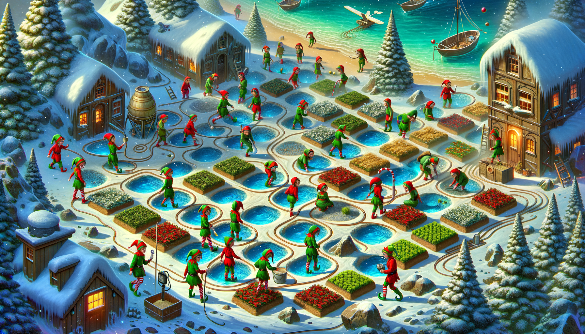
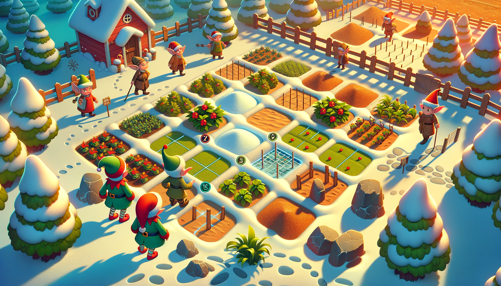

# Day 21: Step Counter

:elf: :snowflake: :seedling: :world_map: :chart_with_upwards_trend: :pick:

In the story, Christmas elves are working to restore snow to Snow Island by filtering water with sand. An elf, known for
his problem-solving skills, is approached by a fellow elf who works with a gardener on a massive farm. This elf needs to
complete his daily step goal using a pedometer and seeks assistance in determining which garden plots he can reach with
his remaining steps. The farm is depicted as a grid with the elf's starting position, garden plots, and obstacles
represented by rocks. The elf can move in cardinal directions but only onto garden plots, not rocks. The narrative
illustrates the elf's potential movement patterns across the farm as he takes steps, with the goal of reaching a
specific number of garden plots within his step limit.

