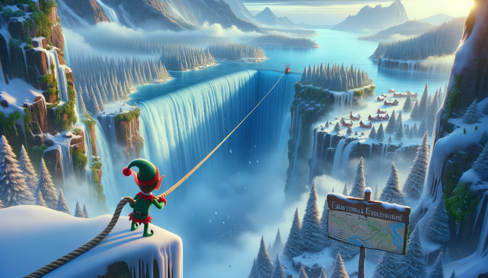
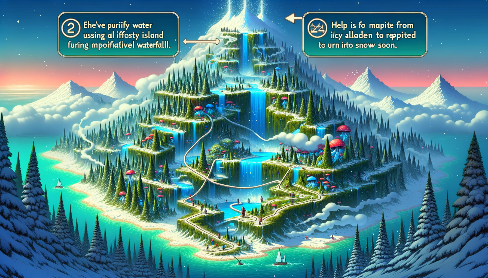

# Day 23: A Long Walk

:elf: :droplet: :snowflake: :walking: :mountain_snow: :foggy: :compass: :no_pedestrians:

In the story, Christmas elves have successfully resumed water filtering operations, resulting in clean water cascading
over the edge of Island Island. They assist by lowering you down from the island with an impossibly long rope, safely
away from the massive waterfall. Upon reaching Snow Island, you notice the water is being absorbed by the air, which
will eventually lead to snowfall. With some time to spare, you decide to explore the picturesque, snowless landscape of
Snow Island.

The story includes a map of hiking trails, which features paths, forest areas, and steep, icy slopes indicated by
arrows. The goal is to traverse from the top to the bottom of the map without repeating any steps, ensuring a scenic
hike. The environment is misty due to the waterfall, suggesting that the slopes are slippery. The map is a grid with a
starting point and a destination, and the challenge is to find the longest possible route through this terrain.

