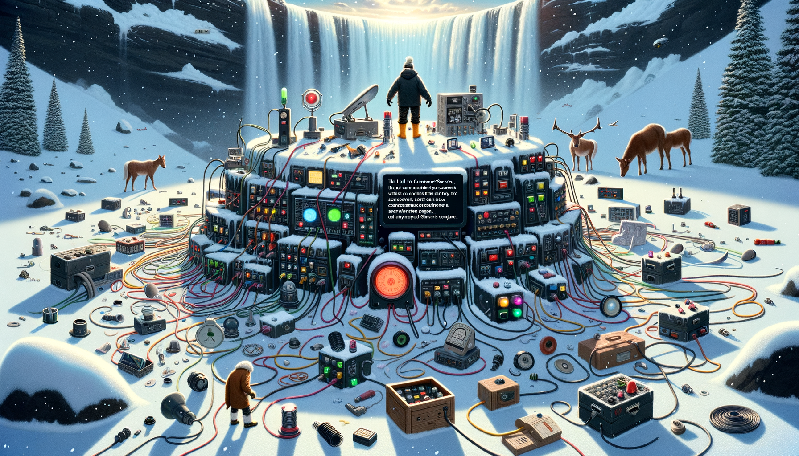
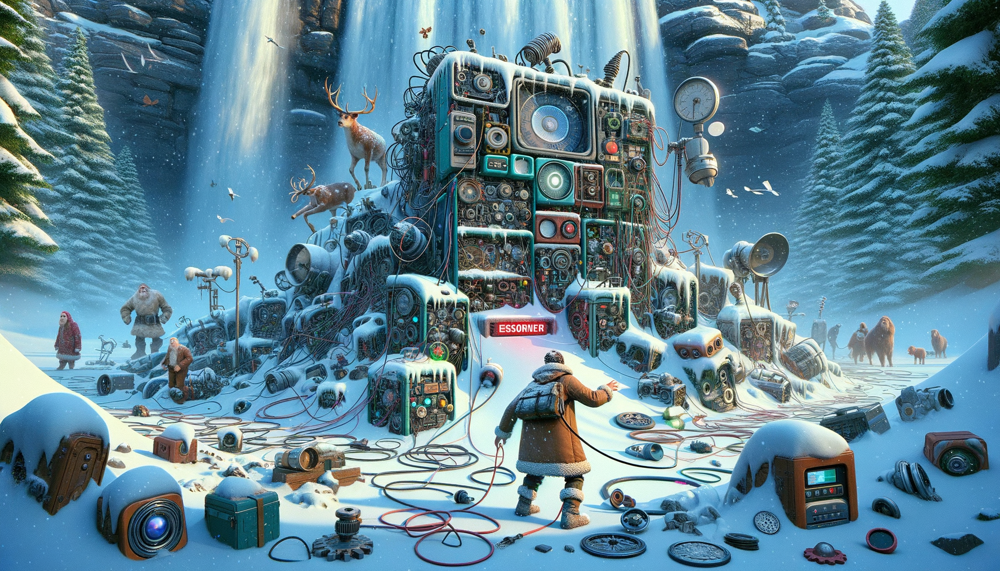

# Day 25: Snowverload

:woman_technologist: :snowflake: :gear: :telephone_receiver: :battery: :red_circle: :christmas_tree:

In the story, the protagonist arrives at the center of Snow Island, beneath a waterfall, to find the source of a snow
shortage. The scene is chaotic, with a plethora of weather machines, almanacs, communication modules, and other
equipment haphazardly wired together into a massive, yet non-functional, snow-producing apparatus. Amidst the disarray,
there are hoof prints, scattered machine parts, mirrors, and lenses. A tiny screen on one of the modules displays an
error message, prompting a call to customer support. The protagonist learns that the error is due to a power overload
from too many connected components. A large red reset button on a separate module is pressed, revealing the extent of
the overload. The protagonist is then faced with the challenge of disconnecting enough components to resolve the
overload, with only three wires to be disconnected and limited time, as it is already Christmas.

